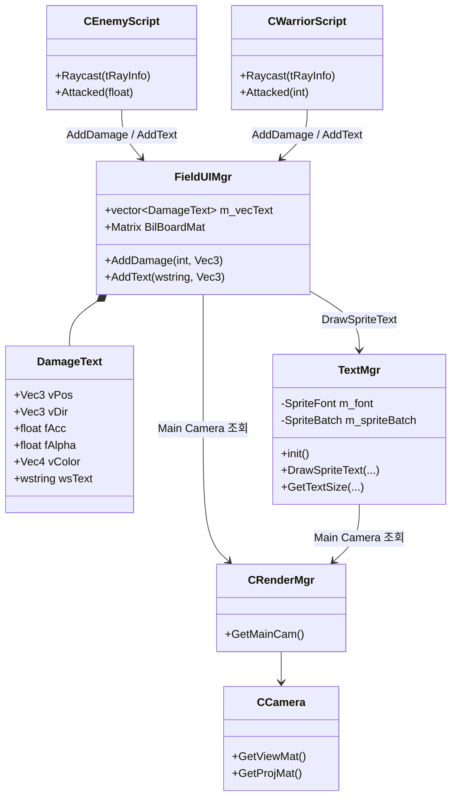

```mermaid
classDiagram
    class CEnemyScript {
        +Raycast(tRayInfo)
        +Attacked(float)
    }

    class CWarriorScript {
        +Raycast(tRayInfo)
        +Attacked(int)
    }

    class FieldUIMgr {
        +vector~DamageText~ m_vecText
        +Matrix BilBoardMat
        +AddDamage(int, Vec3)
        +AddText(wstring, Vec3)
    }

    class DamageText {
        +Vec3 vPos
        +Vec3 vDir
        +float fAcc
        +float fAlpha
        +Vec4 vColor
        +wstring wsText
    }

    class TextMgr {
        -SpriteFont m_font
        -SpriteBatch m_spriteBatch
        +init()
        +DrawSpriteText(...)
        +GetTextSize(...)
    }

    class CRenderMgr {
        +GetMainCam()
    }

    class CCamera {
        +GetViewMat()
        +GetProjMat()
    }

    CEnemyScript --> FieldUIMgr : AddDamage / AddText
    CWarriorScript --> FieldUIMgr : AddDamage / AddText
    FieldUIMgr *-- DamageText
    FieldUIMgr --> CRenderMgr : Main Camera 조회
    FieldUIMgr --> TextMgr : DrawSpriteText
    TextMgr --> CRenderMgr : Main Camera 조회
    CRenderMgr --> CCamera
```